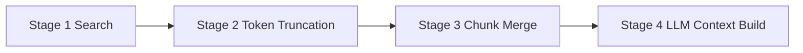

# Hybrid Query Context Gathering & Scoping Research

## Why this document

This document maps the **actual runtime flow** of `/query` (especially `mode="hybrid"`) and explains where context is built, where data is stored, and where product-level scope/filtering can be injected safely.

It is based on the current code paths in:

- `lightrag/api/routers/query_routes.py`
- `lightrag/lightrag.py`
- `lightrag/operate.py`
- `lightrag/utils.py`
- `lightrag/kg/neo4j_impl.py`
- `lightrag/kg/milvus_impl.py`
- `lightrag/kg/redis_impl.py`
- `lightrag/services/product_ingestion/clients/lightrag_client.py`

---

## 1) End-to-end flow for `/query` (hybrid focus)

## 1.1 API entry

`/query` and `/query/data` in `query_routes.py`:

1. Parse `QueryRequest`
2. Convert to `QueryParam` via `to_query_params()`
3. Call `rag.aquery(...)` or `rag.aquery_data(...)`
4. Both route through `kg_query(...)` for `mode in [local, global, hybrid, mix]`

> Note: `QueryRequest` currently includes an `ids` field, but `QueryParam` in `base.py` does **not** currently define `ids`. That means request-level `ids` are not wired into the query pipeline at runtime.

---

## 1.2 High-level runtime graph

---

## 1.3 What hybrid specifically does

Inside `_perform_kg_search(...)`:

- `hybrid` runs **both**:
  - local/entity path: `_get_node_data(ll_keywords, ...)`
  - global/relation path: `_get_edge_data(hl_keywords, ...)`
- `hybrid` does **not** run direct chunk vector search (`_get_vector_context`) — that is `mix` only.
- results are merged round-robin:
  - entities: local + global-derived entities
  - relations: local-derived + global relations

Then context chunks are gathered from `source_id` links on entities/relations via:

- `_find_related_text_unit_from_entities(...)`
- `_find_related_text_unit_from_relations(...)`
- chunk payloads loaded by `text_chunks_db.get_by_ids(...)` (Redis KV in your stack)

---

## 2) How context is actually built

## 2.1 Stage model in `_build_query_context`

### Stage 1: Search

- `_perform_kg_search` returns:
  - `final_entities`
  - `final_relations`
  - `vector_chunks` (only mix mode)
  - `chunk_tracking`
  - `query_embedding`

### Stage 2: Entity/relation token truncation

- `_apply_token_truncation(...)`
- Applies:
  - `max_entity_tokens`
  - `max_relation_tokens`
- Keeps **original object mappings** for later conversion (`entity_id_to_original`, `relation_id_to_original`)

### Stage 3: Chunk merge

- `_merge_all_chunks(...)` merges:
  - vector chunks (mix only)
  - entity-linked chunks
  - relation-linked chunks
- dedupes by `chunk_id`

### Stage 4: Build final context

- `_build_llm_context(...)`
- Computes dynamic chunk token budget from:
  - `max_total_tokens`
  - query tokens
  - prompt template overhead
  - entity/relation context size
- final chunk list passes through `process_chunks_unified(...)` (rerank + top-k + token limit)

---

## 3) Storage model for your stack (Neo4j + Milvus + Redis)

## 3.1 Write path during ingestion

`lightrag_client.insert_text_with_source(...)` does:

- passes `ids=[product_id]` when available (document id)
- builds `file_path` like:
  - `product_id:<pid>:category:<cat>:source:<source_name>`
- passes extra metadata (e.g. `product_id`, `category`, `company`, `category_ids`, etc.)

`apipeline_enqueue_documents(...)` stores metadata in document content object, then chunk generation copies non-content fields into each chunk record.

---

## 3.2 Redis (KV + DocStatus)

### Redis KV namespaces used in this flow

- `full_docs`
- `text_chunks`
- `llm_response_cache`
- `full_entities`
- `full_relations`

### Important behavior

- `text_chunks` KV stores full chunk records as JSON.
- chunk records include copied document metadata (including `product_id` if provided at enqueue time).
- key format: `<workspace>_<namespace>:<id>` (workspace-prefixed).

This is the richest place to recover product-level metadata at query time.

---

## 3.3 Milvus (vectors)

Configured vector collections:

- `entities`
- `relationships`
- `chunks`

### What gets persisted (important)

`LightRAG` initializes `meta_fields` as:

- entities: `{entity_name, source_id, content, file_path}`
- relationships: `{src_id, tgt_id, source_id, content, file_path}`
- chunks: `{full_doc_id, content, file_path}`

Milvus `upsert` only writes fields in `meta_fields` (+ vector, id, created_at).

So even if chunk dicts contain `product_id`, it is **not** currently stored in Milvus unless added to `meta_fields` and schema strategy.

### Scoping implications

- `chunks` collection has `full_doc_id` (which can equal product_id when inserted that way).
- `entities`/`relationships` do not have explicit `product_id`; they rely on `source_id` (chunk ids) and `file_path`.

---

## 3.4 Neo4j (graph)

Nodes and edges are upserted with core properties like:

- node: `entity_id`, `entity_type`, `description`, `source_id`, `file_path`, `created_at`
- edge: `weight`, `description`, `keywords`, `source_id`, `file_path`, `created_at`

`source_id` is a separator-joined list of chunk IDs.

Graph query-time retrieval in hybrid mode uses:

- node/edge lookups based on vector hits
- batch graph methods (`get_nodes_batch`, `get_edges_batch`, etc.)

Neo4j also exposes helper methods:

- `get_nodes_by_chunk_ids(...)`
- `get_edges_by_chunk_ids(...)`

Those can be leveraged for chunk-ID-scoped graph filtering.

---

## 4) Hybrid retrieval internals (detailed)

---

## 5) Where product scope is currently preserved vs lost

## Preserved

1. **Document/Chunk KV (Redis):** metadata fields from enqueue (including `product_id`) are present in chunk JSON.
2. **Chunk vector (Milvus):** `full_doc_id` and `file_path` are stored.
3. **Graph + entity/relation vectors:** `file_path` and `source_id` carry indirect scope signals.

## Not preserved as first-class query filter

1. `QueryParam` has no `ids`/scope field currently.
2. `kg_query`/`_perform_kg_search` do not apply scope predicates.
3. Milvus `query(...)` path currently has no filter expression argument for scope.

---

## 6) Best insertion points for scoping/filtering

## 6.1 Priority order (recommended)

### A) API/Param wiring (must-have)

- Add scope field(s) to `QueryParam` (e.g., `ids`, `product_ids`, or generic `scope`).
- Ensure `QueryRequest.to_query_params()` maps them explicitly.

### B) Early candidate filtering in hybrid search

Inside `_perform_kg_search`:

- after `entities_vdb.query` and `relationships_vdb.query`, filter candidates by scope before graph expansion.
- for entities/relations, evaluate scope from:
  - `file_path` marker (fast, no extra DB calls)
  - or `source_id -> chunk_id -> text_chunks metadata` (more accurate)

### C) Chunk-level hard filter before rerank/truncation

Inside `_merge_all_chunks` / `_find_related_text_unit_*`:

- hard-filter chunks by allowed `product_id` from chunk metadata in Redis.
- this guarantees final `DC` context respects scope even if entity/relation retrieval is broad.

---

## 6.2 Optional stronger optimization

For chunk vectors in Milvus:

- use `full_doc_id` as server-side filter in chunk search (`mix`/`naive`) when scope is doc/product IDs.
- requires extending `MilvusVectorDBStorage.query(...)` to accept optional `filter_expr`.

For entity/relation vectors:

- if you need fast strict filtering without chunk joins, persist normalized scope fields (e.g. `product_ids`) into those collections and include in `meta_fields`.

---

## 7) Concrete scoping strategies you can choose

## Strategy 1: `file_path`-based scope (low effort)

- Parse `product_id:<id>` from `file_path` on entities/relations/chunks.
- Pros: minimal schema changes.
- Cons: relies on encoding convention and string parsing.

## Strategy 2: chunk-metadata-backed scope (accurate)

- Resolve chunk IDs from `source_id`.
- Check chunk metadata (`text_chunks` Redis) for `product_id`.
- Keep candidate entity/relation iff intersection with allowed product IDs is non-empty.
- Pros: robust and explicit.
- Cons: extra KV fetches.

## Strategy 3: first-class indexed scope fields (scalable)

- Add `product_id`/`product_ids` as indexed metadata in Milvus and/or Neo4j properties.
- Apply server-side filtering in vector/graph queries.
- Pros: best performance at scale.
- Cons: migration and ingestion updates required.

---

## 8) Practical verification checklist (before implementation)

1. Confirm product ingestion path always sets either:
   - `ids=[product_id]`, and/or
   - `metadata["product_id"]`, and/or
   - `file_path` with `product_id:<id>`.
2. Validate in Redis `text_chunks` that chunk entries include `product_id`.
3. Validate in Milvus `chunks` that `full_doc_id` is populated as expected.
4. Confirm graph node/edge `file_path` carries product markers for multi-source entities.

---

## 9) Key findings summary

1. Hybrid context is built by **entity+relation vector retrieval + graph expansion + chunk recovery from `source_id`**.
2. Product scope signals exist, but are **indirect** in current query flow.
3. The cleanest first implementation is:
   - wire scope into `QueryParam`
   - enforce hard scope filter at chunk stage
   - add early entity/relation filtering to reduce noise and cost
4. Current `QueryRequest.ids` is not effectively connected to retrieval behavior yet.

---

## 10) Suggested next implementation order

1. Add scope fields to `QueryParam` and request-to-param mapping.
2. Add chunk-level scope guard (authoritative filter).
3. Add entity/relation pre-filter using source chunk metadata.
4. (Optional) add Milvus filter support for `full_doc_id` and explicit scope fields.
