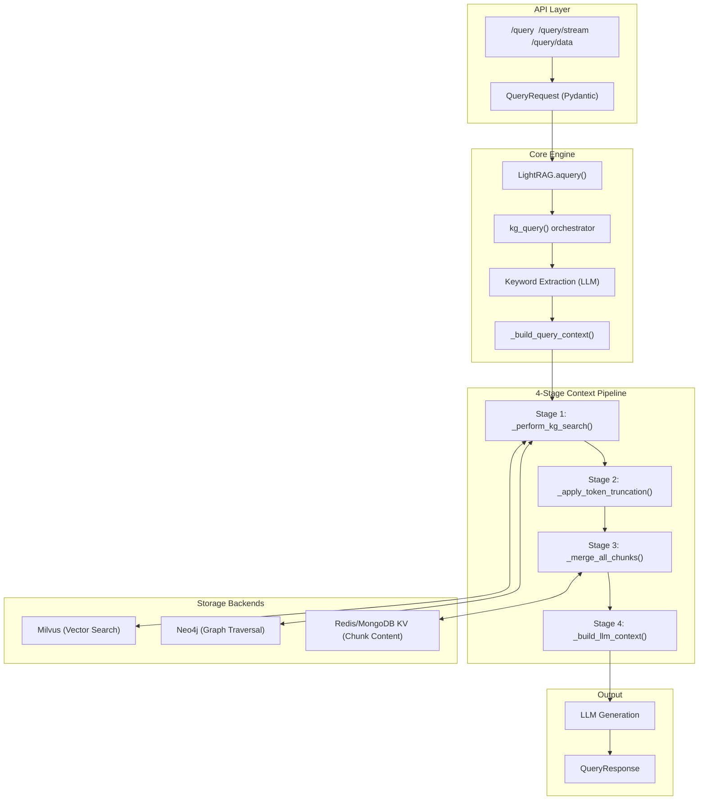
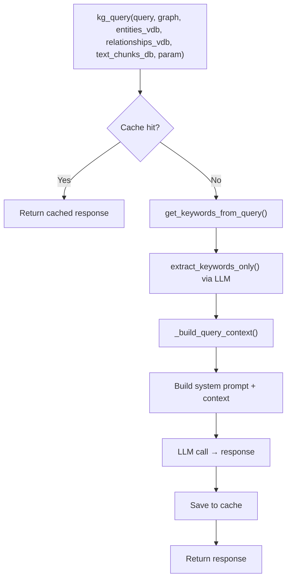
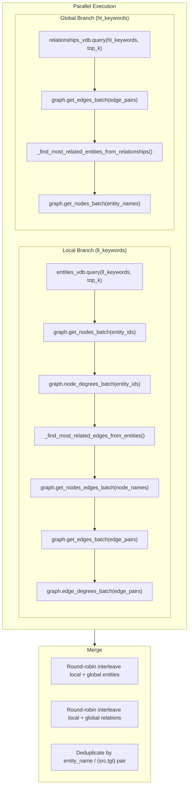
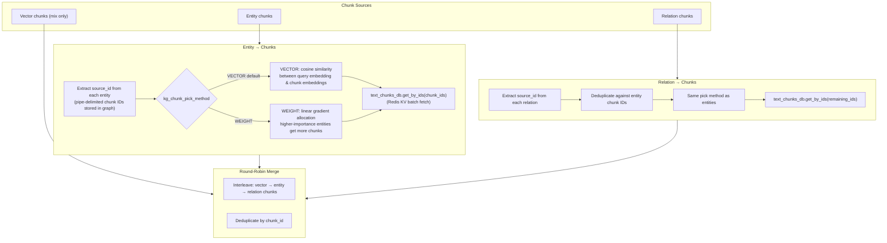
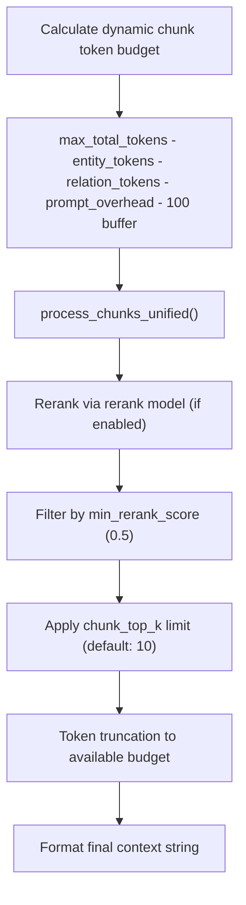
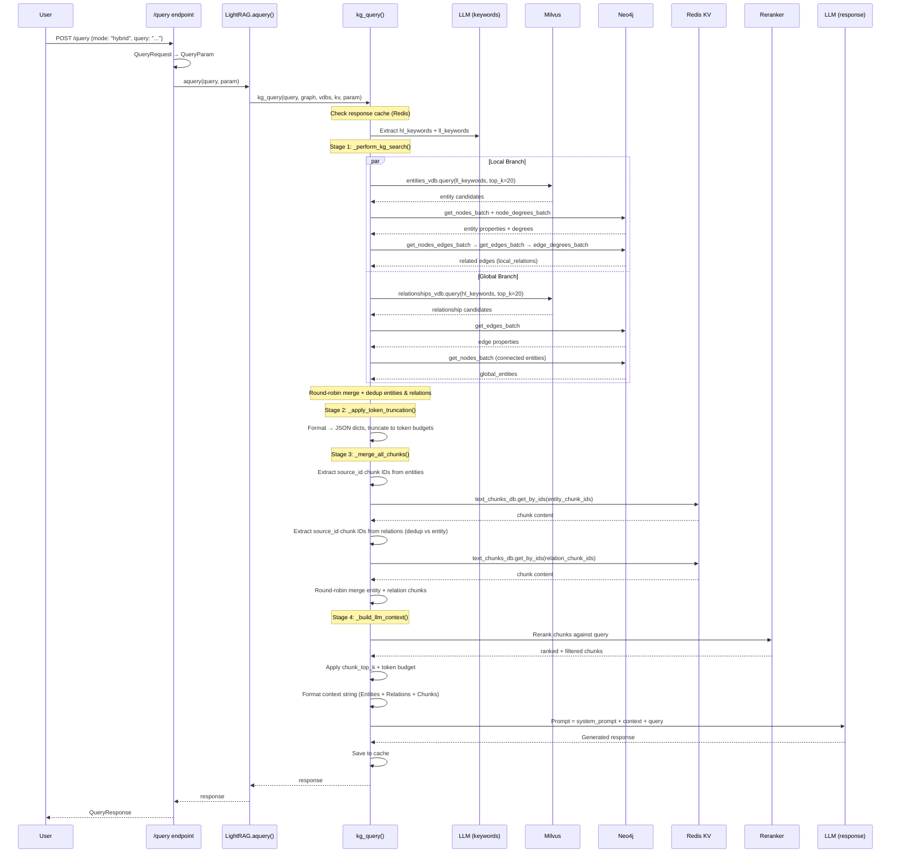
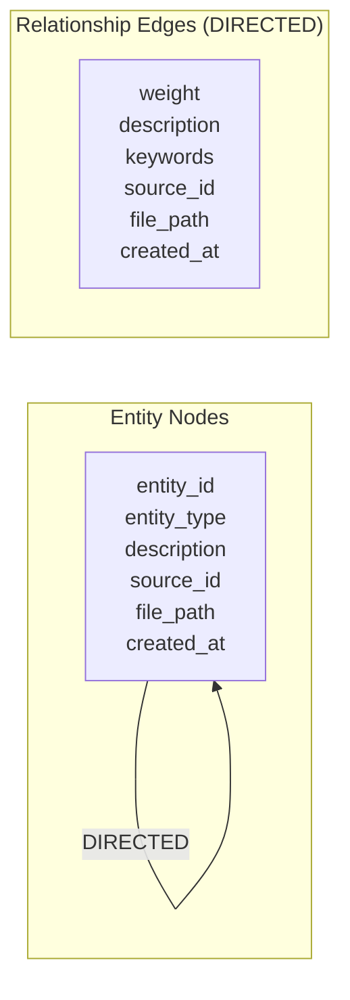
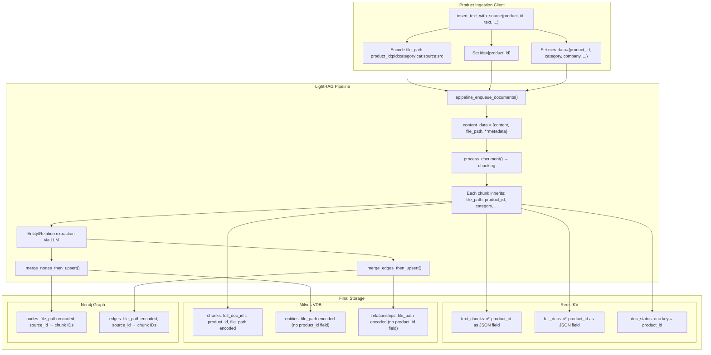
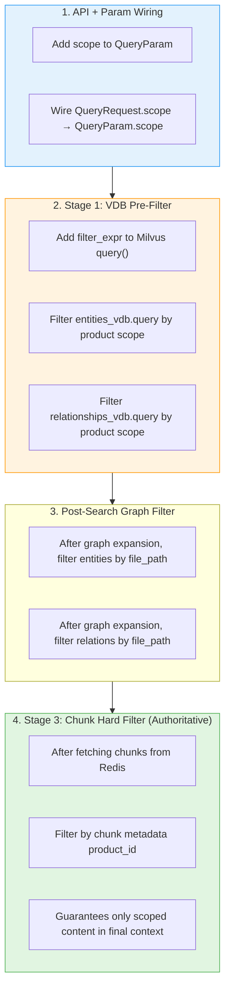

# Query Context Gathering System — Complete Technical Reference

> **Purpose:** Full architectural walkthrough of the `/query` pipeline, with focus on **hybrid mode** context building, storage schemas (Neo4j / Milvus / Redis), product ID metadata flow, and scoping injection points.

---

## Table of Contents

1. [High-Level Architecture](#1-high-level-architecture)
2. [API Layer → QueryParam](#2-api-layer--queryparam)
3. [Query Dispatch in LightRAG.aquery()](#3-query-dispatch-in-lightragatquery)
4. [kg_query() Orchestrator](#4-kg_query-orchestrator)
5. [The 4-Stage Context Pipeline](#5-the-4-stage-context-pipeline)
6. [Hybrid Mode — Complete Call Chain](#6-hybrid-mode--complete-call-chain)
7. [Storage Schemas](#7-storage-schemas)
8. [Product ID Metadata Flow (Ingestion → Storage)](#8-product-id-metadata-flow-ingestion--storage)
9. [Current Filtering & Scoping Capabilities](#9-current-filtering--scoping-capabilities)
10. [Scoping Injection Points](#10-scoping-injection-points)

---

## 1. High-Level Architecture



### Query Modes at a Glance

| Mode         | Entity VDB (Milvus) | Relation VDB (Milvus) | Chunk VDB (Milvus) | Graph (Neo4j)    | KV (Redis)    |
| ------------ | ------------------- | --------------------- | ------------------ | ---------------- | ------------- |
| `local`      | ✅ ll_keywords      | ❌                    | ❌                 | ✅ entity→edges  | ✅ chunks     |
| `global`     | ❌                  | ✅ hl_keywords        | ❌                 | ✅ edge→entities | ✅ chunks     |
| **`hybrid`** | **✅ ll_keywords**  | **✅ hl_keywords**    | **❌**             | **✅ both**      | **✅ chunks** |
| `mix`        | ✅ ll_keywords      | ✅ hl_keywords        | ✅ direct search   | ✅ both          | ✅ chunks     |
| `naive`      | ❌                  | ❌                    | ✅ direct search   | ❌               | ❌            |
| `bypass`     | ❌                  | ❌                    | ❌                 | ❌               | ❌            |

**`hybrid` = `local` ∪ `global`** — entities + relationships from KG, chunks derived from both.
**`mix` = `hybrid` + direct chunk vector search** — adds a 3rd chunk source from Milvus chunks collection.

---

## 2. API Layer → QueryParam

### API Endpoints

Three endpoints in `lightrag/api/routers/query_routes.py`:

| Endpoint        | Method | Purpose                                                       |
| --------------- | ------ | ------------------------------------------------------------- |
| `/query`        | POST   | Full RAG query → LLM-generated response                       |
| `/query/stream` | POST   | Streamed response via NDJSON                                  |
| `/query/data`   | POST   | Structured raw data (entities, relations, chunks) without LLM |

### QueryRequest (Pydantic Model)

```python
class QueryRequest(BaseModel):
    query: str                    # Required, min_length=1
    mode: Literal["local","global","hybrid","naive","mix","bypass"] = "mix"
    only_need_context: bool       # Return context string only, skip LLM
    only_need_prompt: bool        # Return assembled prompt only
    response_type: str            # e.g. "Multiple Paragraphs", "Bullet Points"
    top_k: int                    # VDB result count for entities/relations
    chunk_top_k: int              # Text chunks to keep after rerank
    max_entity_tokens: int        # Token budget for entity context
    max_relation_tokens: int      # Token budget for relation context
    max_total_tokens: int         # Total token budget for entire context
    conversation_history: list    # Chat history
    history_turns: int            # Number of turns to include
    ids: list[str] | None         # ID filter (only used in naive/mix chunk queries)
    user_prompt: str | None       # Custom prompt override
    enable_rerank: bool           # Enable reranking of chunks
```

### QueryParam (Dataclass)

```python
@dataclass
class QueryParam:
    mode: Literal["local","global","hybrid","naive","mix","bypass"] = "mix"
    only_need_context: bool = False
    only_need_prompt: bool = False
    response_type: str = "Multiple Paragraphs"
    stream: bool = False
    top_k: int = 20
    chunk_top_k: int = 10
    max_entity_tokens: int = 6000
    max_relation_tokens: int = 8000
    max_total_tokens: int = 15000
    hl_keywords: list[str] = []      # High-level keywords (global/thematic)
    ll_keywords: list[str] = []      # Low-level keywords (specific/entity)
    conversation_history: list = []
    history_turns: int = 3
    model_func: Callable | None = None
    user_prompt: str | None = None
    enable_rerank: bool = True
```

> **Gap:** `QueryParam` has no `scope` or `ids` field, so `QueryRequest.ids` does not flow into the KG query pipeline.

---

## 3. Query Dispatch in LightRAG.aquery()

**File:** `lightrag/lightrag.py`

```python
async def aquery(self, query, param=QueryParam(), system_prompt=None):
    if param.mode in ["local", "global", "hybrid", "mix"]:
        response = await kg_query(
            query,
            self.chunk_entity_relation_graph,  # Neo4j (BaseGraphStorage)
            self.entities_vdb,                  # Milvus entities (BaseVectorStorage)
            self.relationships_vdb,             # Milvus relationships (BaseVectorStorage)
            self.text_chunks,                   # Redis KV (BaseKVStorage)
            param,
            global_config,
            hashing_kv=self.llm_response_cache, # Redis KV cache
            chunks_vdb=self.chunks_vdb,         # Milvus chunks (BaseVectorStorage)
        )
    elif param.mode == "naive":
        response = await naive_query(...)
    elif param.mode == "bypass":
        response = await use_llm_func(query, ...)
```

---

## 4. kg_query() Orchestrator

**File:** `lightrag/operate.py`



### Keyword Extraction

The LLM extracts two keyword categories from the query:

- **`hl_keywords`** (high-level): thematic/conceptual keywords for global relationship search
- **`ll_keywords`** (low-level): specific entity names for local entity search

These are cached separately (`cache_type="keywords"`) so repeat queries skip the LLM extraction.

---

## 5. The 4-Stage Context Pipeline

This is the heart of the retrieval system. All four stages execute sequentially within `_build_query_context()`.

```mermaid
flowchart LR
    subgraph S1["Stage 1: Search"]
        direction TB
        S1A["Pre-compute query embedding"]
        S1B["Parallel vector + graph search"]
        S1C["Round-robin merge + dedup"]
    end

    subgraph S2["Stage 2: Truncation"]
        direction TB
        S2A["Format entities → JSON"]
        S2B["Format relations → JSON"]
        S2C["Apply token budgets"]
    end

    subgraph S3["Stage 3: Chunk Merge"]
        direction TB
        S3A["Entity source_id → chunk IDs"]
        S3B["Relation source_id → chunk IDs"]
        S3C["Pick chunks (vector sim / weight)"]
        S3D["Fetch content from Redis"]
        S3E["Round-robin merge + dedup"]
    end

    subgraph S4["Stage 4: LLM Context"]
        direction TB
        S4A["Calculate dynamic chunk budget"]
        S4B["Rerank chunks"]
        S4C["Apply chunk_top_k limit"]
        S4D["Format final context string"]
    end

    S1 --> S2 --> S3 --> S4
```



---

### Stage 1: `_perform_kg_search()` — Vector + Graph Search

This stage pre-computes the query embedding once, then launches **parallel** retrieval tasks.



#### `_get_node_data()` (Local/Entity Path)

1. **Milvus:** `entities_vdb.query(ll_keywords, top_k=20)` — cosine similarity search on entity embeddings
2. **Neo4j:** `graph.get_nodes_batch(node_ids)` — batch fetch node properties (`entity_type`, `description`, `source_id`, `file_path`, etc.)
3. **Neo4j:** `graph.node_degrees_batch(node_ids)` — get connection counts for ranking
4. **Neo4j:** `_find_most_related_edges_from_entities()`:
   - `graph.get_nodes_edges_batch(node_names)` — get all edge pairs connected to found entities
   - `graph.get_edges_batch(edge_pairs)` — fetch edge properties (`weight`, `description`, `keywords`, `source_id`, `file_path`)
   - `graph.edge_degrees_batch(edge_pairs)` — edge connection counts
   - Sort by `(rank, weight)` descending

**Returns:** `local_entities`, `local_relations`

#### `_get_edge_data()` (Global/Relation Path)

1. **Milvus:** `relationships_vdb.query(hl_keywords, top_k=20)` — cosine similarity search on relationship embeddings
2. **Neo4j:** `graph.get_edges_batch(edge_pairs)` — batch fetch edge properties
3. **Neo4j:** `_find_most_related_entities_from_relationships()`:
   - Extract unique entity names from edge `src_id`/`tgt_id`
   - `graph.get_nodes_batch(entity_names)` — fetch node properties

**Returns:** `global_relations`, `global_entities`

#### Merge Logic

Entities and relations from both branches are **round-robin interleaved** (alternating local[0], global[0], local[1], global[1]...) with deduplication:

- Entities dedup by `entity_name`
- Relations dedup by sorted `(src, tgt)` pair

---

### Stage 2: `_apply_token_truncation()` — Format & Budget

Each entity/relation is formatted as a JSON dict for LLM consumption:

**Entity format:**

```json
{
  "id": 1,
  "entity": "ProductX",
  "type": "SOFTWARE",
  "description": "...",
  "created_at": 1700000000,
  "file_path": "product_id:abc123:source:ingestion"
}
```

**Relation format:**

```json
{
  "id": 1,
  "entity1": "CompanyA",
  "entity2": "ProductX",
  "description": "CompanyA develops ProductX",
  "created_at": 1700000000,
  "file_path": "..."
}
```

Token truncation via `truncate_list_by_token_size()`:

- Entities truncated to `max_entity_tokens` (default: 6,000)
- Relations truncated to `max_relation_tokens` (default: 8,000)
- Items are added sequentially until budget exhausted

---

### Stage 3: `_merge_all_chunks()` — Chunk Recovery

Chunks are recovered from **three potential sources** (only two for hybrid):



#### Chunk Pick Methods

- **`VECTOR` (default):** `pick_by_vector_similarity()` — computes cosine similarity between query embedding and each candidate chunk's embedding, selects top-N most similar
- **`WEIGHT`:** `pick_by_weighted_polling()` — allocates chunks proportionally based on entity/relation importance ranking (gradient allocation)

#### Key Detail: `source_id`

Every entity and relation in Neo4j stores a `source_id` property — a `<SEP>`-delimited string of chunk IDs that contributed to creating that entity/relation during ingestion. This is the link from the knowledge graph back to the original text chunks.

---

### Stage 4: `_build_llm_context()` — Final Assembly



**Final context string format:**

```
-----Entities(KG)-----
{"id": 1, "entity": "...", "type": "...", "description": "..."}
{"id": 2, "entity": "...", "type": "...", "description": "..."}

-----Relationships(KG)-----
{"id": 1, "entity1": "...", "entity2": "...", "description": "..."}

-----Document Chunks(DC)-----
{"id": 1, "content": "...", "file_path": "..."}
{"id": 2, "content": "...", "file_path": "..."}
```

---

## 6. Hybrid Mode — Complete Call Chain



### Textual Summary

1. **API receives query** → converts `QueryRequest` to `QueryParam`
2. **Cache check** → if cached, return immediately
3. **Keyword extraction** → LLM extracts `hl_keywords` (thematic) and `ll_keywords` (entity-specific)
4. **Parallel vector search** →
   - Milvus `entities` collection searched with `ll_keywords`
   - Milvus `relationships` collection searched with `hl_keywords`
5. **Graph expansion** →
   - Found entities → Neo4j fetches their properties + connected edges
   - Found relationships → Neo4j fetches their properties + connected entities
6. **Merge** → round-robin interleave + deduplicate
7. **Token truncation** → format as JSON, cut to token budgets
8. **Chunk recovery** → extract `source_id` from entities/relations → resolve chunk IDs → batch fetch from Redis KV
9. **Chunk selection** → pick by vector similarity or weight allocation
10. **Rerank + truncate** → rerank model scores chunks → filter → top_k → token budget
11. **Format context** → three sections: Entities(KG), Relationships(KG), Document Chunks(DC)
12. **LLM generation** → prompt = system prompt + formatted context + user query
13. **Cache save** → store for future identical queries

---

## 7. Storage Schemas

### 7.1 Neo4j Graph Storage



**Node properties:**

| Property      | Type   | Description                                               |
| ------------- | ------ | --------------------------------------------------------- |
| `entity_id`   | string | Unique ID = entity name (also used as node label)         |
| `entity_type` | string | e.g. "Organization", "Person" (also added as Neo4j label) |
| `description` | string | LLM-generated description                                 |
| `source_id`   | string | Chunk IDs joined by `<SEP>`                               |
| `file_path`   | string | File paths joined by `<SEP>`, max 32KB                    |
| `created_at`  | int    | Unix timestamp                                            |

**Edge properties:**

| Property      | Type   | Description                            |
| ------------- | ------ | -------------------------------------- |
| `weight`      | float  | Accumulated importance weight          |
| `description` | string | LLM-generated relationship description |
| `keywords`    | string | Comma-separated keywords               |
| `source_id`   | string | Chunk IDs joined by `<SEP>`            |
| `file_path`   | string | File paths joined by `<SEP>`           |
| `created_at`  | int    | Unix timestamp                         |

**Indexes:** `entity_id`, `name`, `entity_type`, `created_at`

**Workspace isolation:** All queries use a workspace label for multi-tenant isolation.

### 7.2 Milvus Vector Collections

Three separate collections, all with `enable_dynamic_field=True`:

#### Entities Collection (`*_entities`)

| Field         | DataType       | Index    | Notes                                         |
| ------------- | -------------- | -------- | --------------------------------------------- |
| `id`          | VARCHAR(64)    | Primary  | `ent-<md5>`                                   |
| `vector`      | FLOAT_VECTOR   | HNSW/IVF | Embedding of `"{entity_name}\n{description}"` |
| `created_at`  | INT64          | —        | Unix timestamp                                |
| `entity_name` | VARCHAR(512)   | INVERTED | Entity name                                   |
| `file_path`   | VARCHAR(32768) | —        | File paths (nullable)                         |

**meta_fields:** `{entity_name, source_id, content, file_path}`

Dynamic fields (stored but not in explicit schema): `source_id`, `content`, `description`, `entity_type`

#### Relationships Collection (`*_relationships`)

| Field        | DataType       | Index    | Notes                                                    |
| ------------ | -------------- | -------- | -------------------------------------------------------- |
| `id`         | VARCHAR(64)    | Primary  | `rel-<md5>`                                              |
| `vector`     | FLOAT_VECTOR   | HNSW/IVF | Embedding of `"{keywords}\t{src}\n{tgt}\n{description}"` |
| `created_at` | INT64          | —        | Unix timestamp                                           |
| `src_id`     | VARCHAR(512)   | INVERTED | Source entity name                                       |
| `tgt_id`     | VARCHAR(512)   | INVERTED | Target entity name                                       |
| `file_path`  | VARCHAR(32768) | —        | File paths (nullable)                                    |

**meta_fields:** `{src_id, tgt_id, source_id, content, file_path}`

#### Chunks Collection (`*_chunks`)

| Field         | DataType       | Index    | Notes                   |
| ------------- | -------------- | -------- | ----------------------- |
| `id`          | VARCHAR(64)    | Primary  | `chunk-<md5>`           |
| `vector`      | FLOAT_VECTOR   | HNSW/IVF | Embedding of chunk text |
| `created_at`  | INT64          | —        | Unix timestamp          |
| `full_doc_id` | VARCHAR(64)    | INVERTED | Parent document ID      |
| `file_path`   | VARCHAR(32768) | —        | File path (nullable)    |

**meta_fields:** `{full_doc_id, content, file_path}`

> **Key gap:** No `product_id` field exists in any Milvus collection schema or `meta_fields`. Scoping would require either parsing `file_path` strings or adding `product_id` to schema + `meta_fields`.

### 7.3 Redis / MongoDB KV Storage

#### Text Chunks (`text_chunks` namespace)

| Field               | Type   | Description                                        |
| ------------------- | ------ | -------------------------------------------------- |
| `_id`               | string | `chunk-<md5>`                                      |
| `content`           | string | Chunk text content                                 |
| `full_doc_id`       | string | Parent document ID (can be `product_id`)           |
| `tokens`            | int    | Token count                                        |
| `chunk_order_index` | int    | Position in parent document                        |
| `file_path`         | string | Source file path (encoded with product_id)         |
| `product_id`        | string | ✅ Present if passed via metadata during ingestion |
| `category`          | string | ✅ Present if passed via metadata                  |
| `company`           | string | ✅ Present if passed via metadata                  |
| `create_time`       | int    | Unix timestamp                                     |
| `update_time`       | int    | Unix timestamp                                     |

> **This is the richest store for product metadata.** All metadata passed during `ainsert()` is preserved here as schemaless JSON fields.

#### Document Status (`doc_status` namespace)

| Field             | Type   | Description                         |
| ----------------- | ------ | ----------------------------------- |
| `_id`             | string | Document ID (can be `product_id`)   |
| `status`          | string | pending/processing/processed/failed |
| `file_path`       | string | Source file path                    |
| `content_summary` | string | First ~100 chars                    |
| `chunks_count`    | int    | Number of chunks                    |
| `chunks_list`     | array  | List of chunk IDs                   |
| `metadata`        | dict   | All extra metadata                  |

#### LLM Response Cache (`llm_response_cache`)

Keyed by `args_hash` of query parameters, stores cached query and keyword extraction results.

---

## 8. Product ID Metadata Flow (Ingestion → Storage)



### Product ID Presence by Store

| Store    | Collection      | Has `product_id`? | Access Method                                                      |
| -------- | --------------- | ----------------- | ------------------------------------------------------------------ |
| Redis KV | `text_chunks`   | ✅ Direct field   | `metadata["product_id"]`                                           |
| Redis KV | `full_docs`     | ✅ Direct field   | `metadata["product_id"]`                                           |
| Redis KV | `doc_status`    | ✅ Document key   | `_id = product_id`                                                 |
| Milvus   | `chunks`        | ⚠️ Indirect       | `full_doc_id` = product_id (when ingested with `ids=[product_id]`) |
| Milvus   | `entities`      | ❌ Indirect only  | Parse from `file_path` string                                      |
| Milvus   | `relationships` | ❌ Indirect only  | Parse from `file_path` string                                      |
| Neo4j    | Nodes           | ❌ Indirect only  | Parse from `file_path` or trace `source_id` → chunks → KV          |
| Neo4j    | Edges           | ❌ Indirect only  | Parse from `file_path` or trace `source_id` → chunks → KV          |

### file_path Encoding Pattern

```
product_id:<product_id>:category:<category>:source:<source_name>
```

For multi-source entities/relations, values are joined with `<SEP>`:

```
product_id:abc123:category:CRM:source:ingestion<SEP>product_id:def456:category:ERP:source:ingestion
```

---

## 9. Current Filtering & Scoping Capabilities

### What Exists Today

| Mechanism                      | Where          | Effect                                             |
| ------------------------------ | -------------- | -------------------------------------------------- |
| `top_k`                        | Milvus queries | Limits vector search results (default: 20)         |
| `chunk_top_k`                  | Stage 4        | Limits chunks after rerank (default: 10)           |
| `max_entity_tokens`            | Stage 2        | Token budget for entities (default: 6,000)         |
| `max_relation_tokens`          | Stage 2        | Token budget for relations (default: 8,000)        |
| `max_total_tokens`             | Stage 4        | Overall token budget (default: 15,000)             |
| `cosine_better_than_threshold` | Milvus         | Similarity threshold on VDB search                 |
| `min_rerank_score`             | Stage 4        | Score threshold for reranked chunks (default: 0.5) |
| `enable_rerank`                | Stage 4        | Toggle reranking                                   |
| `ids` in `QueryRequest`        | API only       | **NOT** wired into KG query pipeline               |
| `hl_keywords`/`ll_keywords`    | Stage 1        | Pre-set keywords bypass LLM extraction             |
| Workspace label                | Neo4j          | Multi-tenant isolation                             |

### What Does NOT Exist

- ❌ No product-level scope filter on `QueryParam`
- ❌ No `filter` expression passed to Milvus `query()` method
- ❌ No file_path or product_id filtering in graph traversal
- ❌ No chunk-level product filtering before rerank
- ❌ `QueryRequest.ids` does not flow to `QueryParam` or into retrieval functions

### Milvus Query Method (No Filter Currently)

```python
# Current implementation — no filter parameter
async def query(self, query: str, top_k: int, query_embedding: list[float] = None):
    results = self._client.search(
        collection_name=self.final_namespace,
        data=embedding,
        limit=top_k,
        output_fields=list(self.meta_fields),
        search_params={
            "metric_type": "COSINE",
            "params": {"radius": self.cosine_better_than_threshold},
        },
        # NOTE: No filter= parameter here
    )
```

But `search_by_ids()` already demonstrates how filtered search works:

```python
# Existing pattern in search_by_ids — validates that filter works
filter_expr = f'id in ["{id_list}"]'
results = self._client.search(..., filter=filter_expr, ...)
```

---

## 10. Scoping Injection Points

### Where Scope Can Be Injected in the Hybrid Pipeline



### Recommended Implementation Order

#### Step 1: API + Param Wiring (Must-Have)

- Add `QueryScope` dataclass to `lightrag/types.py`:
  ```python
  @dataclass
  class QueryScope:
      product_id: str | None = None
      category_id: str | None = None
  ```
- Add `scope: QueryScope | None = None` to `QueryParam`
- Add `scope` field to `QueryRequest` and wire through `to_query_params()`

#### Step 2: Chunk-Level Scope Guard (Authoritative Filter)

- In `_find_related_text_unit_from_entities()` and `_find_related_text_unit_from_relations()`:
  - After fetching chunks from Redis KV, filter by `product_id` match
  - This guarantees the Document Chunks (DC) section only contains scoped content
- **Why this first:** chunks are the most direct text evidence; scoping them has the highest impact on answer quality

#### Step 3: Entity/Relation Pre-Filter (Noise Reduction)

- After Stage 1 vector search results, before or after graph expansion:
  - Filter entity/relation candidates by `file_path` (parse `product_id:<id>` pattern)
  - Or resolve `source_id` → chunk IDs → Redis KV metadata → check `product_id`
- **Trade-off:** `file_path` parsing is fast but relies on encoding convention; Redis lookup is accurate but adds latency

#### Step 4: Milvus Server-Side Filter (Performance Optimization)

- Add `filter` parameter to `MilvusVectorDBStorage.query()`:
  ```python
  async def query(self, query, top_k, query_embedding=None, filter_expr=None):
      results = self._client.search(..., filter=filter_expr, ...)
  ```
- Build filter expression from scope:
  ```python
  '(file_path like "%product_id:abc123%")'
  ```
- Requires `file_path` to have an INVERTED index in Milvus for performance
- Or add `product_id` as a first-class field to entity/relationship collections for cleaner filtering

### Scope Filter Decision Matrix

| Strategy                               | Effort | Accuracy | Performance             | Schema Changes                    |
| -------------------------------------- | ------ | -------- | ----------------------- | --------------------------------- |
| `file_path` string parse (post-filter) | Low    | Medium   | Medium                  | None                              |
| Chunk metadata lookup (Redis verify)   | Medium | High     | Medium (extra KV calls) | None                              |
| First-class Milvus field (server-side) | High   | High     | Best (pre-filter)       | Yes: schema + meta_fields + index |
| Hybrid (file_path + chunk verify)      | Medium | High     | Good                    | None                              |

### Multi-Product Entity Challenge

Entities that span multiple products will have multiple product IDs in their `file_path` (joined by `<SEP>`). The scoping logic must handle this:

```
file_path: "product_id:abc:source:ingestion<SEP>product_id:def:source:ingestion"
```

- An entity should be **included** if ANY of its file_path segments match the scope
- But the entity's `description` may blend information from multiple products — this is an inherent KG characteristic
- The authoritative scope control is at the **chunk level** (Stage 3), where each chunk maps to exactly one product

### Existing Test Specifications

Test file `tests/scope/test_scope_unit.py` already defines expected behavior:

- `QueryScope` with `product_id` and `category_id` fields
- `QueryParam` accepting an optional `scope` object
- `MilvusVectorDBStorage._build_scope_filter()` generating filter expressions:
  ```python
  '(product_id == "product_001" or file_path like "%product_id:product_001%")'
  ```

These tests serve as the specification for the scoping implementation.

---

## Key File References

| File                                   | Relevant Content                                      |
| -------------------------------------- | ----------------------------------------------------- |
| `lightrag/api/routers/query_routes.py` | API endpoints, QueryRequest model                     |
| `lightrag/base.py`                     | QueryParam dataclass, abstract storage classes        |
| `lightrag/lightrag.py`                 | aquery() dispatch, VDB meta_fields config, ainsert()  |
| `lightrag/operate.py`                  | kg_query(), \_build_query_context(), 4-stage pipeline |
| `lightrag/kg/milvus_impl.py`           | Milvus schema, query(), search_by_ids()               |
| `lightrag/kg/neo4j_impl.py`            | Neo4j node/edge operations, graph traversal           |
| `lightrag/kg/mongo_impl.py`            | MongoDB KV storage, chunk/doc storage                 |
| `lightrag/types.py`                    | Type definitions (QueryScope to be added)             |
| `lightrag/utils.py`                    | process_chunks_unified(), truncation utils            |
| `lightrag/services/product_ingestion/` | Product ingestion client, file_path encoding          |
| `tests/scope/test_scope_unit.py`       | Scope filter test specifications                      |
